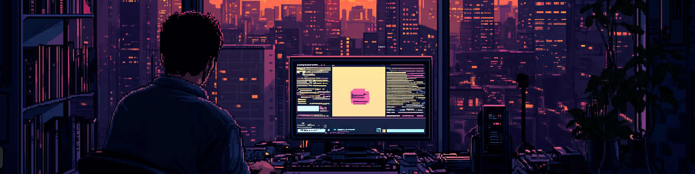

<h1 align="center">Hey there, I'm Cristhian Taipe </h1>

<p align="center">
  
</p>

<p align="center">
  <a href="https://www.linkedin.com/in/cristhian-taipe2024/">
    
  </a>
  <a href="https://github.com/cristhian-bot0/writeup_ctf">
    
  </a>
</p>

<p align="center">
  
</p>

---


### `> whoami`

```
Cybersecurity Enthusiast & Ethical Hacker
CTF Player always hunting flags
Arch Linux daily driver (btw)
Building tools for pentesting & offensive security
Software Engineering Student
```

<br clear="right"/>

---

### `> cat skills.txt`

<p align="center">
  
  
  
  
  
  
  
  
  
  
</p>

---

### `> stats --verbose`

<p align="center">
  
  
</p>

<p align="center">
  
</p>

---

### `> ls projects/`

<div align="center">

| Project | Description |
|:--------|:------------|
| [`writeup_ctf`](https://github.com/cristhian-bot0/writeup_ctf) | My writeups from CTF competitions |
| [`Port_Scanner`](https://github.com/cristhian-bot0/Port_Scanner) | Custom port scanning tool |
| [`qtile-cyberpunk`](https://github.com/cristhian-bot0/qtile-cyberpunk) | Cyberpunk-themed Qtile WM config |
| [`metodologiaCTF`](https://github.com/cristhian-bot0/metodologiaCTF) | CTF methodology and notes |

</div>

---

<p align="center">
  
</p>

<p align="center">
  
</p>
